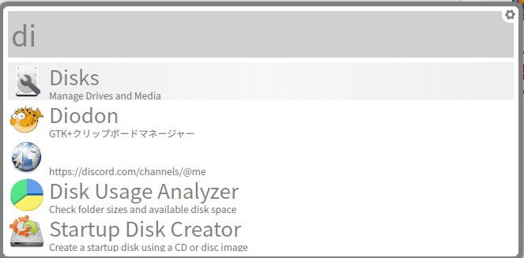
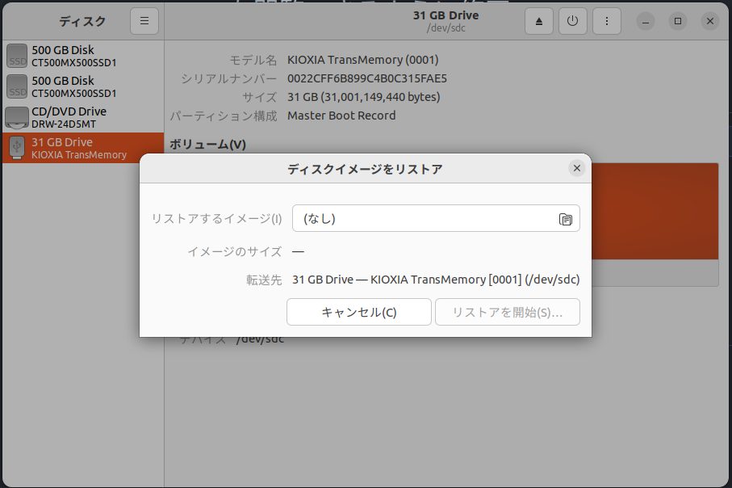

## 1. USBを準備する

## 2. USBをフォーマットする

### Ubuntuの場合

1. Disksアプリを起動する



2. USBのフォーマットを行う
    1. アプリのアクションボタンからディスクを初期化を選択
    2. クイックを選択
    3. 実行

### macOSの場合

<!-- 手順をここに書く -->

## 3. ISOファイルをDLする

国内のミラーサイトから取得することを推奨

- JAIST(北陸先端大): https://ftp.jaist.ac.jp/pub/Linux/ubuntu-releases/
- 山形大学: http://ftp.yz.yamagata-u.ac.jp/pub/linux/ubuntu-releases/
- IIJ: https://ftp.iij.ad.jp/pub/linux/ubuntu/releases/
- 理研(RIKEN): https://ftp.riken.jp/Linux/ubuntu-releases/

## 4. SHA256SUMSでハッシュ照合する

1. ISOをダウンロードしたミラーの同じフォルダにSHA256SUMSというtxtファイルが存在する
2. こちらもDLする
3. 以下のコマンドを実行する
```sh
sha256sum -c SHA256SUMS --ignore-missing
```
4. OKと出れば成功

## 5. ISOファイルをUSBに書き込む

1. Disksアプリのアクションボタンからディスクイメージをリストア
2. DLしたイメージを選択してリストア開始

